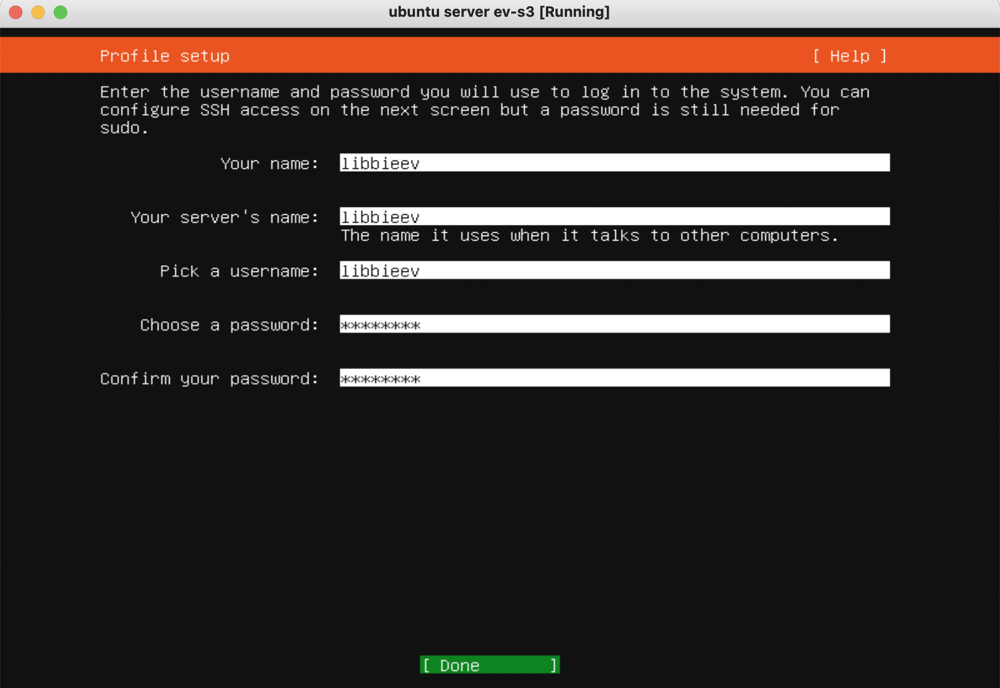
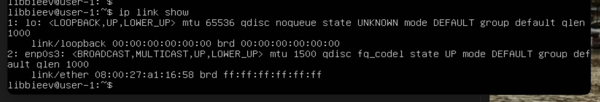
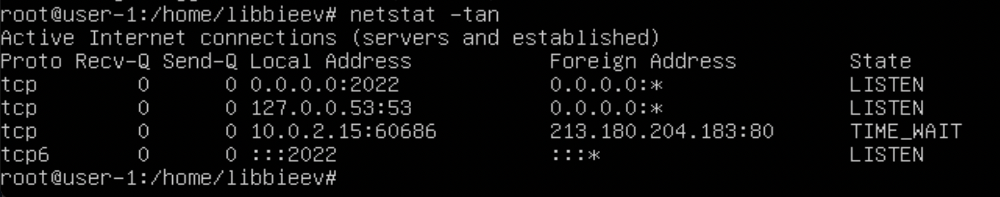

## Part 1. Установка ОС
+ Ввожу имя пользователя:  

+ Версия системы:  

## Part 2. Создание пользователя
+ Команда для создания пользователя и её вывод:  

+ cat /etc/passwd:  

## Part 3. Настройка сети ОС
+ Устанавливаю название машины как user-1, отредактировав файлы /etc/hostname и /etc/hosts:  

+ Вывод команды hostname после перезагрузки:  

+ Устанавливаю временную зону, соответствующую нашему текущему местоположению. В Казани одно время с Москвой.

+ Вывожу названия сетевых интерфейсов с помощью консольной команды.

(Интерфейс **lo** присутствует потому, что это т.н. loopback - способ связи компьютера с самим собой. Доступ к компьютеру через знаменитое 127.0.0.1 (a.k.a. localhost) возможен благодаря ему.)  
+ Используя консольную команду, получаю ip адрес устройства, на котором я работаю, от DHCP сервера.  

(DHCP расшифровывается как Dynamic Host Configuration Protocol — протокол динамической настройки узла.)  
+ Узнаю внешний ip-адрес шлюза (ip)...  

+ ...и внутренний, он же ip-адрес по умолчанию (gw).

+ Задаю статичные настройки, отредактировав файл в директории /etc/netplan/

+ После перезагрузки:

+ Пингую удаленные хосты 1.1.1.1 и ya.ru:

## Part 4. Обновление ОС
+ В результате команды do-release-upgrade -d произошло обновление.

## Part 5. Использование команды sudo
 Команда **sudo** ( **s**ubstitute **u**ser and **do**, подменить пользователя и выполнить) позволяет строго определенным пользователям выполнять указанные программы с административными привилегиями без ввода пароля суперпользователя **root**. Если быть точнее, то команда sudo позволяет выполнять программы от имени любого пользователя, но, если идентификатор или имя этого пользователя не указаны, то предполагается выполнение от имени суперпользователя root. Таким образом, использование sudo позволяет выполнять привилегированные команды обычным пользователям без необходимости ввода пароля суперпользователя root .
+ Разрешаю пользователю, созданному в Part 2, выполнять команду sudo.

+ Меняю hostname ОС от его иммени.

## Part 6. Установка и настройка службы времени

## Part 7. Установка и использование текстовых редакторов
### Создание файла
+ Vim

Для выхода c сохранением изменений я нажал Esc, затем ввёл :x и нажал Enter.
+ Nano

Для выхода c сохранением изменений я нажал Ctrl+O, затем Enter, затем Ctrl+X.
+ Joe

Для выхода c сохранением изменений я нажал Ctrl+K, затем X.
### Редактирование файла
+ Vim

Для выхода без сохранения я нажал Esc, затем ввёл :q! и нажал Enter.
+ Nano

Для выхода c сохранением изменений я нажал Ctrl+X, затем N.
+ Joe

Для выхода c сохранением изменений я нажал Ctrl+C, затем Y.
### Поиск и замена внутри файла
+ Vim - поиск

+ Vim - замена

+ Nano - поиск

+ Nano - замена

+ Joe - поиск

+ Joe - замена

## Part 8. Установка и базовая настройка сервиса SSHD
+ Установка службы SSHd.  

+ Добавление автостарта службы при загрузке системы.  
Для этого используем команду systemctl enable sshd.service.

+ Перенастраиваем службу SSHd на порт 2022.
vim /etc/ssh/sshd_config

/etc/init.d/ssh restart
+ Наличие процесса sshd:

Ключ -е используется для показа всех процессов со стандартным синтаксисом, а grep достаёт из списка нужную нам строку.
+ Вывод команды netstat -tan:

Ключ -n показывает номерные адреса вместо того, чтобы пытаться определить символические.  
Ключ -а показывает все сокеты: и прослушиваемые, и нет.  
Ключ -t показывает TCP-порты.  
  
**Значение каждого столбца**  
Proto: протокол, используемый сокетом.  
Recv-Q: количество байтов, не скопированных пользовательской программой, подключенной к этому сокету.  
Send-Q: количество неподтвержденных байтов удаленного хоста  
Local Address: локальный адрес (имя локального хоста) и номер порта сокета. Если не указана опция -n, адрес сокета разрешается в соответствии с полным именем хоста (FQDN), а номер порта преобразуется в соответствующее имя службы.  
Foreign Address: удаленный адрес (имя удаленного хоста) и номер порта сокета.  
State: состояние сокета. LISTEN означает ожидание входящих соединений.  
  
**0.0.0.0** в колонке значит, что на данном порту слушаются все сетевые интерфейсы.

## Part 9. Установка и использование утилит top, htop
+ Вывод команды top.

  
uptime: 48 минут  
количество авторизованных пользователей: 1  
общая загрузка системы за последнюю минуту, 5 и 15 минут: 0, 0, 0  
общее количество процессов: 96  
загрузка cpu: 0, простаивающая вычислительная мощность - 100  
загрузка памяти: всего 976.9, 159.1 свободно, 155.6 использовано, 662.2 задействовано в буфере и кэше  
pid процесса занимающего больше всего памяти: 1  
pid процесса, занимающего больше всего процессорного времени: 2528

**htop**
+ отсортированo по PID

+ по PERCENT_CPU 

+ по PERCENT_MEM

+ по TIME

+ отфильтровано для процесса sshd

+ с процессом syslog, найденным, используя поиск

+ с добавленным выводом hostname, clock и uptime

## Part 10. Использование утилиты fdisk

  
Жёсткий диск называется /dev/sda, его размер 10 гб, количество секторов 20967424 (2048+1857596+19107840).

+ Под swap выделено 1.7 гб:  
  

## Part 11. Использование утилиты df
+ Команда df.
  
  
Размер корневого размера 9336140 кб, занято 4364608 кб, свободно 4477556 кб, использовано 50%.

+ Команда df -Th.
  
  
Размер корневого размера 9.0 гб, занято 4.2 гб, свободно 4.3 гб, использовано 50%. Файловая система ext4.

## Part 12. Использование утилиты du
+ Вывод размера папок /home, /var, /var/log (в байтах и в человекочитаемом виде):
  
+ Вывод размера всего содержимого в /var/log
  

## Part 13. Установка и использование утилиты ncdu
  
  
  

## Part 14. Работа с системными журналами
+ Часть вывода /var/log/dmesg
  
+ Часть вывода /var/log/syslog
  
+ Часть вывода /var/log/auth.log
  

Время последней успешной авторизации - 15:45:26, пользователь libbieev, метод входа - залогинился.

+ Перезапускаем sshd и убеждаемся в её рестарте
  

## Part 15. Использование планировщика заданий CRON

+ crontab -e  
  
+ строчки из системного журнала:  
  
+ удаление заданий:  
  
  